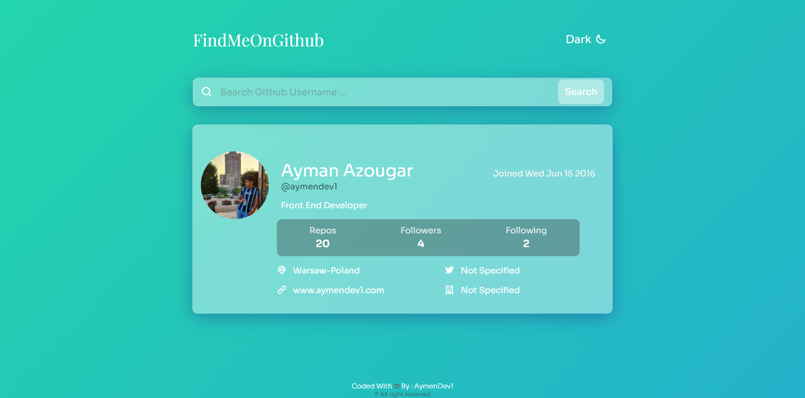

# FindMeOnGithub

This is a project inspired from some content creators , the main idea is to make the search for GitHub users easy , this app is giving you , the main necessarily informations about the user (Full name , bio , Number of followers ...) and the Social Informations such Location and Social Media .

## Table of contents

- [Overview](#overview)
  - [The challenge](#the-challenge)
  - [Screenshot](#screenshot)
  - [Links](#links)
- [My process](#my-process)
  - [Built with](#built-with)
- [Author](#author)

## Overview

### The challenge

Users should be able to:

- Request for Informations about any Github User

### Screenshot

### Links

- Solution URL: [Click Me !](https://github.com/aymendev1/FindMeOnGithub-App)
- Live Site URL: [Click Me !](https://findmeongithub-app.herokuapp.com/)

### Built with

- Semantic HTML5 markup
- CSS custom properties
- CSS Grid System
- Flexbox
- JavaScript
- Jquery
- [Animsta ](https://animista.net/) - For Css Animations
- [Iconscout](https://iconscout.com/unicons) - Icons Library
- [NodeJS](https://nodejs.org/en/) - JS Library for Backend
- [ExpressJS](https://expressjs.com/) - NodeJS Library
- [BodyParser](https://www.npmjs.com/package/body-parser) -NodeJS Package to Pass Data from Client to Server
- [Fetch](https://www.npmjs.com/package/fetch-json) - To Fetch Json on Server
- [Github API](https://api.github.com/) - Github API who gaves Informations

## Author

- Website - [Aymen's Portfolio](https://www.your-site.com)
- LinkedIn- [@aymanazougar](https://www.linkedin.com/in/aymanazougar/)
